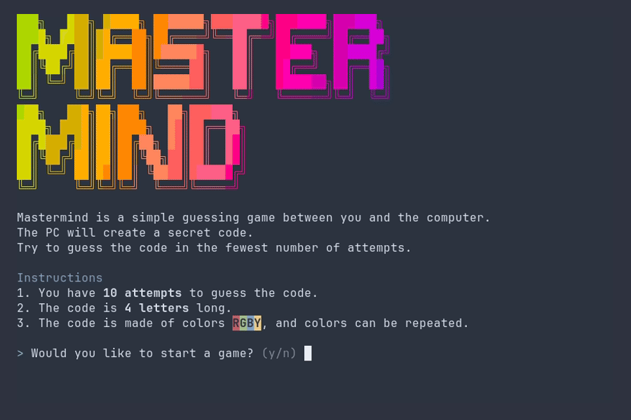

<h1 align="center">✨ Mastermind ✨</h1>



## Requirements

- Java 15+
- Maven
- Make (optional)

## Build Instructions

Inside the mastermind repo run:
```bash
# with Maven
mvn compile

# or with `make`
make compile
```

## Running

> [!WARNING]
> Do NOT run this project in your IDE's (Netbeans, Intellji, etc.) console, use a real terminal.

```bash
# manually with java
java --class-path ./target/classes/ com.example.mastermind.App

# or with `make`
make run
```

## Credits

- UI/UX was heavly inspired by <https://github.com/xprmnts/mastermind-cli>
